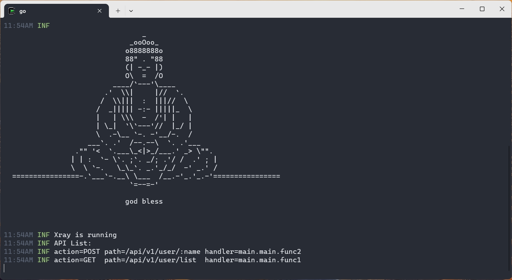

# Xray

universal router for http, websocket and custom protocol, one is all.

[![Build Status][1]][2] [![MIT licensed][3]][4] [![Go Version][5]][6] [![codecov][7]][8] [![Go Report Card][9]][10]

[1]: https://github.com/xray-family/xray/workflows/Go%20Test/badge.svg?branch=main

[2]: https://github.com/xray-family/xray/actions?query=branch%3Amain

[3]: https://img.shields.io/badge/license-MIT-blue.svg

[4]: LICENSE

[5]: https://img.shields.io/badge/go-%3E%3D1.18-30dff3?style=flat-square&logo=go

[6]: https://github.com/xray-family/xray

[7]: https://codecov.io/gh/lxzan/xray/branch/main/graph/badge.svg?token=0Tx9xH9Lvd

[8]: https://codecov.io/gh/lxzan/xray

[9]: https://goreportcard.com/badge/github.com/xray-family/xray

[10]: https://goreportcard.com/report/github.com/xray-family/xray

#### Feature

- amazing 100% branch coverage for unit tests
- no dependence
- dynamic separation matching request paths, powered by map and trie
- the onion model middleware, router group
- adapt to `http`, `fasthttp`, `lxzan/gws` ...

#### Index

- [Xray](#xray)
  - [Feature](#feature)
  - [Index](#index)
  - [Quick Start](#quick-start)
  - [WebSocket](#websocket)
    - [Server](#server)
    - [Client](#client)
  - [Route](#route)
    - [Static](#static)
    - [Dynamic](#dynamic)
  - [Middleware](#middleware)
  - [Codec](#codec)
    - [WWW Form Codec](#www-form-codec)
    - [JSON Codec](#json-codec)
  - [Swagger](#swagger)
  - [Benchmark](#benchmark)
    - [RPS](#rps)
    - [Route Algorithm](#route-algorithm)
  - [Acknowledgements](#acknowledgements)

#### Quick Start

```go
package main

import (
    "github.com/xray-family/xray"
    httpAdapter "github.com/xray-family/xray/contrib/adapter/http"
    "github.com/xray-family/xray/contrib/codec/jsoniter"
    "github.com/xray-family/xray/contrib/log/zerolog"
    "net/http"
)

func main() {
    var router = xray.New(
        xray.WithJsonCodec(jsoniter.Codec),
        xray.WithLogger(zerolog.Logger),
    )
    router.Use(xray.Recovery(), xray.AccessLog())
    var group = router.Group("/api/v1")

    group.GET("/user/list", func(ctx *xray.Context) {
        _ = ctx.WriteJSON(http.StatusOK, []string{"ming", "hong"})
    })

    group.POST("/user/:name", func(ctx *xray.Context) {
        _ = ctx.WriteJSON(http.StatusOK, xray.Any{
            "hello": ctx.Param("name"),
        })
    })

    if err := http.ListenAndServe(":3000", httpAdapter.NewAdapter(router)); err != nil {
        zerolog.Logger.Panic(err.Error())
    }
}

```

- Output



#### WebSocket

##### Server

```go
package main

import (
    "github.com/lxzan/gws"
    "github.com/xray-family/xray"
    gwsAdapter "github.com/xray-family/xray/contrib/adapter/gws"
    httpAdapter "github.com/xray-family/xray/contrib/adapter/http"
    "github.com/xray-family/xray/contrib/codec/jsoniter"
    "github.com/xray-family/xray/contrib/log/zerolog"
    "net/http"
)

func main() {
    router := xray.New(
        xray.WithLogger(zerolog.Logger),
        xray.WithJsonCodec(jsoniter.Codec),
    )
    router.Use(xray.Recovery(), xray.AccessLog())

    handler := &WebSocketHandler{adapter: gwsAdapter.NewAdapter(router)}
    upgrader := gws.NewUpgrader(handler, nil)

    router.GET("/connect", func(ctx *xray.Context) {
        socket, err := upgrader.Upgrade(ctx.Writer.Raw().(http.ResponseWriter), ctx.Request.Raw.(*http.Request))
        if err != nil {
            zerolog.Logger.Error(err.Error())
            return
        }
        go socket.ReadLoop()
    })

    router.GET("/greet/:name", func(ctx *xray.Context) {
        ctx.Writer.Header().Set(xray.ContentType, "plain/text")
        _ = ctx.WriteString(http.StatusOK, "world!")
    })

    if err := http.ListenAndServe(":3000", httpAdapter.NewAdapter(router)); err != nil {
        zerolog.Logger.Panic(err.Error())
    }
}

type WebSocketHandler struct {
    gws.BuiltinEventHandler
    adapter *gwsAdapter.Adapter
}

func (c *WebSocketHandler) OnMessage(socket *gws.Conn, message *gws.Message) {
    if err := c.adapter.ServeWebSocket(socket, message); err != nil {
        zerolog.Logger.Error(err.Error())
    }
}

```

##### Client

```js
let ws = new WebSocket('ws://127.0.0.1:3000/connect');
ws.send('0047[["X-Path","/greet/caster"],["X-Method","GET"]]hello');
```

#### Route

##### Static

```go
router.GET("/ping", func (ctx *xray.Context) {})
```

##### Dynamic

```go
router.POST("/user/:id", func (ctx *xray.Context) {})
```

#### Middleware


```go
package main

import (
    "github.com/xray-family/xray"
    httpAdapter "github.com/xray-family/xray/contrib/adapter/http"
    "net/http"
)

func main() {
    var router = xray.New()

    router.Use(func(ctx *xray.Context) {
        print(1)
        ctx.Next()
        print(2)
    })

    var group = router.Group("/api/v1", func(ctx *xray.Context) {
        print(3)
        ctx.Next()
        print(4)
    })

    group.GET("/greet", func(ctx *xray.Context) {
        print(5)
    })

    _ = http.ListenAndServe(":3000", httpAdapter.NewAdapter(router))
}

```

```
output: 1, 3, 5, 4, 2
```

#### Codec

##### WWW Form Codec

```go
func Greet(ctx *xray.Context) {
    type Input struct {
        Name string `form:"name"`
        Age  int    `form:"age"`
    }

    var input = &Input{}
    _ = wwwform.Codec.NewDecoder(ctx.Request.Body).Decode(input)
    _ = ctx.Request.Body.Close()
}
```

##### JSON Codec

```go
func Greet(ctx *xray.Context) {
    type Input struct {
        Name string `json:"name"`
        Age  int    `json:"age"`
    }
    
    var input = &Input{}
    ctx.BindJSON(input)
}
```

#### Swagger

1. install command tool

```bash
go install github.com/swaggo/swag/cmd/swag@latest
```

2. generate docs

```bash
swag init
```

3. write your code

```go
package main

import (
    swaggerFiles "github.com/swaggo/files"
    "github.com/xray-family/xray"
    httpAdapter "github.com/xray-family/xray/contrib/adapter/http"
    "github.com/xray-family/xray/contrib/doc/swagger"
    "github.com/xray-family/xray/contrib/log/zerolog"
    _ "github.com/xray-family/xray/examples/debug/docs"
    "net/http"
)

// PingExample godoc
// @Summary ping example
// @Schemes
// @Description do ping
// @Tags example
// @Accept json
// @Produce json
// @Success 200 {string} Helloworld
// @Router /example/helloworld [get]
func Helloworld(ctx *xray.Context) {
    _ = ctx.WriteJSON(http.StatusOK, "helloworld")
}

func main() {
    var router = xray.New()
    router.Use(xray.Recovery(), xray.AccessLog())

    router.GET("/swagger/:any", swagger.WrapHandler(swaggerFiles.Handler))

    router.GET("/api/v1/example/helloworld", Helloworld)

    if err := http.ListenAndServe(":3000", httpAdapter.NewAdapter(router)); err != nil {
        zerolog.Logger.Panic(err.Error())
    }
}

```

#### Benchmark

##### RPS

- `xray / Standard`

```
wrk -t4 -c100 -d10s http://127.0.0.1:3000/test
Running 10s test @ http://127.0.0.1:3000/test
  4 threads and 100 connections
  Thread Stats   Avg      Stdev     Max   +/- Stdev
    Latency   842.21us    1.16ms  16.97ms   86.80%
    Req/Sec    50.92k     8.35k   74.41k    71.00%
  2029109 requests in 10.03s, 230.28MB read
Requests/sec: 202250.69
Transfer/sec:     22.95MB
```

- `xray / FastHTTP`

```
wrk -t4 -c100 -d10s http://127.0.0.1:3000/test
Running 10s test @ http://127.0.0.1:3000/test
  4 threads and 100 connections
  Thread Stats   Avg      Stdev     Max   +/- Stdev
    Latency   770.07us    1.76ms  24.38ms   92.02%
    Req/Sec    87.59k    17.29k  132.58k    64.25%
  3495445 requests in 10.06s, 463.36MB read
Requests/sec: 347469.03
Transfer/sec:     46.06MB
```

- `Standard`

```
wrk -t4 -c100 -d10s http://127.0.0.1:3002/test
Running 10s test @ http://127.0.0.1:3002/test
  4 threads and 100 connections
  Thread Stats   Avg      Stdev     Max   +/- Stdev
    Latency   824.42us    1.20ms  24.56ms   87.58%
    Req/Sec    54.28k     9.66k   84.70k    69.75%
  2163902 requests in 10.05s, 249.70MB read
Requests/sec: 215292.62
Transfer/sec:     24.84MB
```

- `FastHTTP`

```
wrk -t4 -c100 -d10s http://127.0.0.1:3001/test
Running 10s test @ http://127.0.0.1:3001/test
  4 threads and 100 connections
  Thread Stats   Avg      Stdev     Max   +/- Stdev
    Latency   682.07us    1.85ms  34.71ms   93.02%
    Req/Sec   103.69k    22.77k  175.90k    64.39%
  4096885 requests in 10.07s, 543.09MB read
Requests/sec: 406843.81
Transfer/sec:     53.93MB
```

##### Route Algorithm

- `xray`

```
go test -benchmem -run=^$ -bench . github.com/xray-family/xray
goos: linux
goarch: amd64
pkg: github.com/xray-family/xray
cpu: 13th Gen Intel(R) Core(TM) i5-1340P
BenchmarkOneRoute-16                    80629566                14.47 ns/op            0 B/op          0 allocs/op
BenchmarkOneRouteDynamic-16             32121697                36.72 ns/op            0 B/op          0 allocs/op
BenchmarkRecoveryMiddleware-16          64666132                18.72 ns/op            0 B/op          0 allocs/op
Benchmark5Params-16                     15670220                77.95 ns/op            0 B/op          0 allocs/op
BenchmarkOneRouteJSON-16                76349024                14.26 ns/op            0 B/op          0 allocs/op
Benchmark404-16                         65392963                18.02 ns/op            0 B/op          0 allocs/op
Benchmark404Many-16                     31475818                37.31 ns/op            0 B/op          0 allocs/op
PASS
```

- gin

```
goos: linux
goarch: amd64
pkg: github.com/gin-gonic/gin
cpu: 13th Gen Intel(R) Core(TM) i5-1340P
BenchmarkOneRoute-16                    46832172                25.24 ns/op            0 B/op          0 allocs/op
BenchmarkRecoveryMiddleware-16          39644233                30.11 ns/op            0 B/op          0 allocs/op
Benchmark5Params-16                     17872981                63.42 ns/op            0 B/op          0 allocs/op
BenchmarkOneRouteJSON-16                 6274351               190.3 ns/op            48 B/op          3 allocs/op
Benchmark404-16                         34617291                34.86 ns/op            0 B/op          0 allocs/op
Benchmark404Many-16                     28456966                41.69 ns/op            0 B/op          0 allocs/op
PASS
```

#### Acknowledgements

- [gin-swagger](https://github.com/swaggo/gin-swagger)
